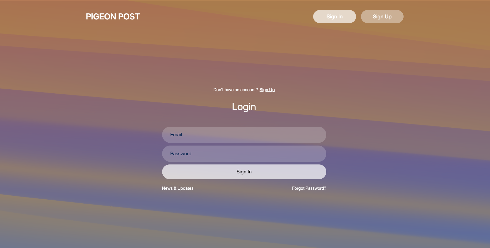

<!-- Improved compatibility of back to top link: See: https://github.com/othneildrew/Best-README-Template/pull/73 -->
<a id="readme-top"></a>
<!--
*** Thanks for checking out the Best-README-Template. If you have a suggestion
*** that would make this better, please fork the repo and create a pull request
*** or simply open an issue with the tag "enhancement".
*** Don't forget to give the project a star!
*** Thanks again! Now go create something AMAZING! :D
-->

<!-- PROJECT LOGO -->
<br />
<div align="center">
    
  

  <h3 align="center">Pigeon Post</h3>

  <p align="center">
    <br />
    <a href="https://pigeonpost.netlify.app">Live Demo</a>
  </p>
</div>


<!-- TABLE OF CONTENTS -->
<details>
  <summary>Table of Contents</summary>
  <ol>
    <li>
      <a href="#about-the-project">About The Project</a>
      <ul>
        <li><a href="#built-with">Built With</a></li>
      </ul>
    </li>
    <li>
      <a href="#getting-started">Getting Started</a>
      <ul>
        <li><a href="#installation">Installation</a></li>
      </ul>
    </li>
    <li><a href="#usage">Usage</a></li>
    <li><a href="#roadmap">Roadmap</a></li>
    <li><a href="#contact">Contact</a></li>
    <li><a href="#acknowledgments">Acknowledgments</a></li>
  </ol>
</details>


<!-- ABOUT THE PROJECT -->
## About The Project

<a href="https://pigeonpost.netlify.app">
    
</a>

Pigeon Post is a messaging application similar WhatsApp. User can create account, send messages, media, documents, voice messages as well as make voice or video calls. Friend requests can be sent using the username of the user.

Here's the full list of features:
* Ability to send all types of messages including Contact information of different user
* Ability to make voice/video calls
* Ability to create group chat with multiple users
* Ability to perform group functions(example: Give user admin rights, remove user from group, add user to group and so on) :smile:
* Ability to change name, description, profile picture


<p align="right">(<a href="#readme-top">back to top</a>)</p>


### Built With


* [![React][React.js]][React-url]
* [![Vite][Vite.js]][Vite-url]
* [![Firebase][Firebase.js]][Firebase-url]
* [![Netlify][Netlify.js]][Netlify-url]

<p align="right">(<a href="#readme-top">back to top</a>)</p>


<!-- GETTING STARTED -->
## Getting Started

To get a local copy up and running follow these simple example steps.

### Installation

Follow the instruction to get the local copy of the app.

1. Clone the repo
   ```sh
   git clone https://github.com/Ferid2003/Pigeon_Post.git
   ```
2. Install NPM packages
   ```sh
   npm install
   ```
3. Enter your Firebase configs in `Firebase.js`
   ```js
   const firebaseConfig = {
    apiKey: ///,
    authDomain: ///,
    databaseURL: ///,
    projectId: ///,
    storageBucket: ///,
    messagingSenderId: ///,
    appId: ///,
    measurementId: ///,
   }

   ```
4. Enter your Stream API key in `Stream.jsx`<br/>
   Note that you can leave this part if you do not plan on using Stream functionality
   ```js
   return new StreamVideoClient({
            apiKey: ////,
            token: userStreamToken,
            user: { id: userData.uid },
        });

   ```
6. Change git remote url to avoid accidental pushes to base project
   ```sh
   git remote set-url origin github_username/repo_name
   git remote -v # confirm the changes
   ```

<p align="right">(<a href="#readme-top">back to top</a>)</p>


<!-- USAGE EXAMPLES -->
## Usage

Here are the screenshots from different parts of application.

### Login/Register Page


### Friend Request Sending Screen


### Group Settings Screen


### User Settings Screen


### Group Functions


### Message Functions


### Chat Information Screen


<p align="right">(<a href="#readme-top">back to top</a>)</p>


<!-- ROADMAP -->
## Roadmap

- [x] Add smooth mobile experience
- [ ] Add ability to change wallpaper
- [ ] Add chat customization options
- [ ] Add message search for chats

<p align="right">(<a href="#readme-top">back to top</a>)</p>


<!-- CONTACT -->
## Contact

Farid Aghazada - feridagazade157@gmail.com

Project Link: [https://github.com/Ferid2003/Pigeon_Post](https://github.com/Ferid2003/Pigeon_Post)

<p align="right">(<a href="#readme-top">back to top</a>)</p>


<!-- ACKNOWLEDGMENTS -->
## Acknowledgments

* [Stream](https://getstream.io)
* [Shader Gradient](https://www.shadergradient.co)
* [Happy Hues](https://www.happyhues.co)
* [Best-README-Template](https://github.com/othneildrew/Best-README-Template)

<p align="right">(<a href="#readme-top">back to top</a>)</p>


<!-- MARKDOWN LINKS & IMAGES -->
<!-- https://www.markdownguide.org/basic-syntax/#reference-style-links -->
[forks-shield]: https://img.shields.io/github/forks/othneildrew/Best-README-Template.svg?style=for-the-badge
[forks-url]: https://github.com/othneildrew/Best-README-Template/network/members
[stars-shield]: https://img.shields.io/github/stars/othneildrew/Best-README-Template.svg?style=for-the-badge
[stars-url]: https://github.com/othneildrew/Best-README-Template/stargazers
[issues-shield]: https://img.shields.io/github/issues/othneildrew/Best-README-Template.svg?style=for-the-badge
[issues-url]: https://github.com/othneildrew/Best-README-Template/issues
[license-shield]: https://img.shields.io/github/license/othneildrew/Best-README-Template.svg?style=for-the-badge
[license-url]: https://github.com/othneildrew/Best-README-Template/blob/master/LICENSE.txt
[linkedin-shield]: https://img.shields.io/badge/-LinkedIn-black.svg?style=for-the-badge&logo=linkedin&colorB=555
[linkedin-url]: https://linkedin.com/in/othneildrew
[product-screenshot]: images/screenshot.png
[React.js]: https://img.shields.io/badge/React-20232A?style=for-the-badge&logo=react&logoColor=61DAFB
[React-url]: https://reactjs.org/
[Vite.js]: https://img.shields.io/badge/Vite-646CFF?style=for-the-badge&logo=vite&logoColor=white
[Vite-url]: https://vitejs.dev/
[Firebase.js]: https://img.shields.io/badge/Firebase-FFCA28?style=for-the-badge&logo=firebase&logoColor=black
[Firebase-url]: https://firebase.google.com/
[Netlify.js]: https://img.shields.io/badge/Netlify-00C7B7?style=for-the-badge&logo=netlify&logoColor=white
[Netlify-url]: https://www.netlify.com/


